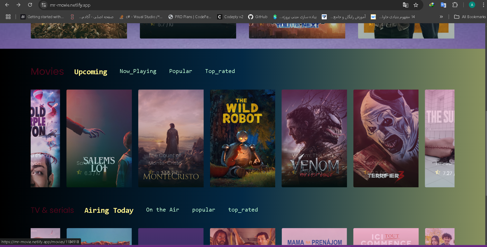
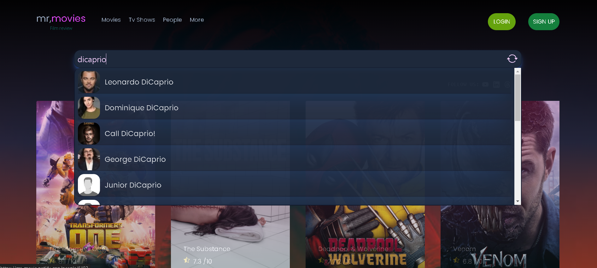

# React + Vite

# MrMovie

MrMovie یک پروژه وب است که با استفاده از React و Vite ایجاد شده و به شما این امکان را می‌دهد تا اطلاعات مربوط به فیلم‌ها و سریال‌ها را مشاهده کنید.

## اسکرین‌شات‌ها





[مشاهده دمو در نتلیفای](https://mr-movie.netlify.app)

## ویژگی‌ها

- **نمایش فیلم‌ها و سریال‌های جدید و پرطرفدار**: به‌روز بودن اطلاعات فیلم‌ها و سریال‌ها به صورت روزانه.
- **اشتراک‌گذاری (Share)**: شما می‌توانید فیلم‌ها و سریال‌ها را با دیگران به اشتراک بگذارید.
- **افزودن به علاقه‌مندی‌ها (Add to Favorites)**: فیلم‌ها و سریال‌های مورد علاقه خود را به لیست علاقه‌مندی‌ها اضافه کنید.
- **افزودن به لیست تماشا (Add to Watch List)**: فیلم‌ها و سریال‌هایی که می‌خواهید بعداً تماشا کنید را به لیست تماشا اضافه کنید.
- **جستجو بر اساس بازیگران و کارگردان‌ها**: قابلیت جستجو بر اساس نام بازیگران، کارگردان‌ها و هنرپیشه‌ها و نمایش فیلم‌ها و آثار مرتبط با آن‌ها.
- **هدایت به سایت TMDB**: برای دانلود و مشاهده جزئیات بیشتر، به سایت TMDB هدایت می‌شوید.

## ابزارها و تکنولوژی‌های مورد استفاده

- **Vite**: برای ایجاد پروژه و مدیریت باندل‌ها.
- **React**: برای ساخت رابط کاربری.
- **Tailwind CSS**: برای طراحی استایل‌ها.
- **Swiper**: برای ایجاد اسلایدرها.

## دیتابیس

این پروژه از [The Movie Database (TMDB)](https://www.themoviedb.org/) برای دریافت اطلاعات مربوط به فیلم‌ها و سریال‌ها استفاده می‌کند.

## نصب و راه‌اندازی:**npm run dev  /npm i


1. **کلون کردن مخزن**:
   ```bash
   git clone https://github.com/your_username/mrmovie.git
   cd mrmovie

- [@vitejs/plugin-react](https://github.com/vitejs/vite-plugin-react/blob/main/packages/plugin-react/README.md) uses [Babel](https://babeljs.io/) for Fast Refresh
- [@vitejs/plugin-react-swc](https://github.com/vitejs/vite-plugin-react-swc) uses [SWC](https://swc.rs/) for Fast Refresh
